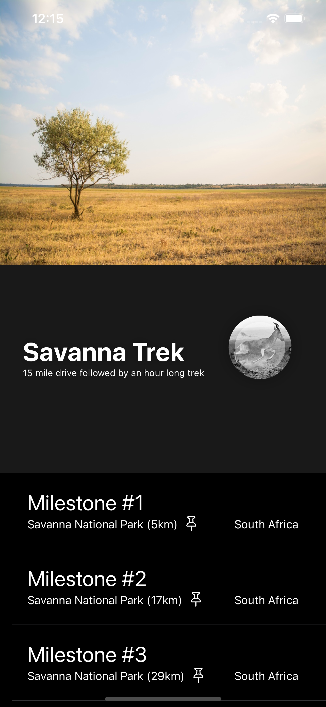

# Practice_iOS_Animations

[iOS Animations by Tutorials (raywenderlich)](https://www.raywenderlich.com/books/ios-animations-by-tutorials/v6.0/)

### Chapter 1

### Chapter 2

### Chapter 3

### Chapter 4

- usingSpringWithDamping
- initialSpringVelocity

### Chapter 6

- CGAffineTransform(translationX:y:)
- CAEmitterLayer (SnowView)

### Chapter 7

- UIView.animateKeyframes
- UIView.addKeyframe

### Chapter 9

### Chapter 10

- Core Animation
